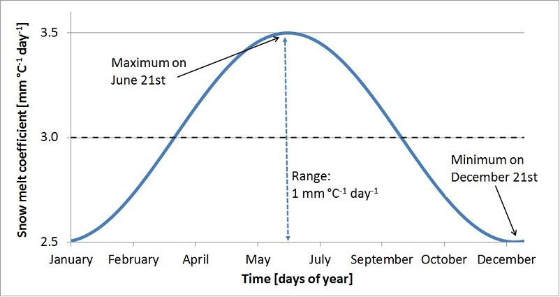
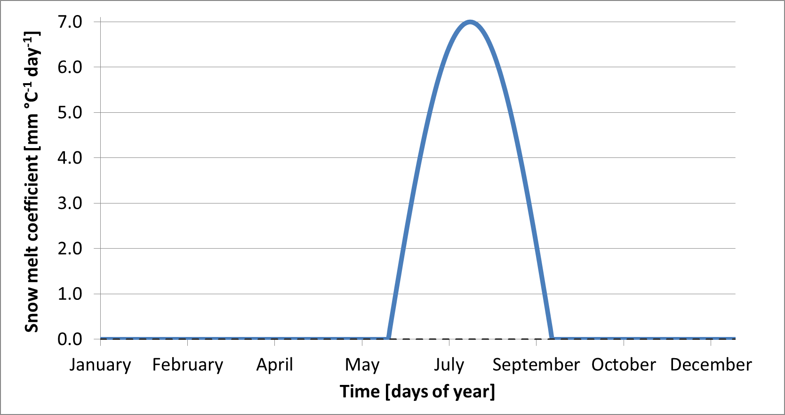

## Snow module

The LISFLOOD snow module uses a modification of the degree-day method to simulate the snow water equivalent ($\text{SWE}$) accumulated over every pixel in the catchment.

### Elevation zones

For large pixel sizes, there may be considerable sub-pixel heterogeneity in snow accumulation and melt, which is a particular problem if there are large elevation differences within a pixel. Because of this, snow melt and accumulation are modelled separately for 3 separate elevation zones, which are defined at the sub-pixel levelas shown in Figure 1.

***Figure 1.** Definition of sub-pixel elevation zones in the snow module. Snowmelt and accumulation calculations in each zone are based on elevation (and derived temperature) in centroid of each zone.*

The division in elevation zones is based on a normal distribution, which was found to adequately fit the real distribution of the elevation of e.g. 100m SRTM DEM pixels within a 5x5km grid cell. Three elevation zones *A*, *B*, and *C* are defined with each zone occupying one third of the pixel surface. Assuming further that $\bar{T}$ is valid for the average pixel elevation, average temperature is extrapolated to the centroids of the lower (*A*) and upper (*C*) elevation zones, using a fixed temperature lapse rate ($\gamma$) of $0.0065~^\circ\mathrm{C}\,\mathrm{m}^{-1}$. 

$$
T_z = 
\begin{cases}
\bar{T} - 0.9674 \cdot \sigma_z \cdot \gamma & \text{if zone A} \\
\bar{T} & \text{if zone B} \\
\bar{T} + 0.9674 \cdot \sigma_z \cdot \gamma & \text{if zone C}
\end{cases}
$$

Snow accumulation and melting are subsequently modelled separately for each elevation zone, assuming that temperature can be approximated by the temperature at the centroid of each respective zone. Only the glacier melt redistributes snow from the higher to the lower elevation zones.

### Snowfall-rainfall partition

In order to achieve an accurate represenation of the catchment hydrological processes, it is important to partition the measured precipitation ($P$) into rainfall ($RF$) and snowfall ($SF$). 

This distinction is controlled by the average temperature ($\bar{T}$). If $\bar{T}$ is below a threshold $T_{snow}$, all the observed precipitation is assumed to be snow. A $T_{snow}$ value of $1\,^\circ C$ is recommended. A snow correction factor $SnowFactor$ is then applied to correct for undercatch of snow precipitation. Undercatch in this context refers to the mismeasurement of snowfall by a rain gauge. For instance, when using traditional rain gauges, wind gusts can blow some of the snow away from the gauge, or, vice-versa, accumulate snow within the gauge. The computation is summarised as follows:

$$
\begin{cases}
SF_z = \text{SnowFactor} \cdot P & \text{if } T_z < T_{snow} \\
RF_z = P & \text{if } T_z \ge T_{snow}
\end{cases}
$$

### Snow melt

Differently from rain, snow accumulates on the soil surface until it melts. The rate of snowmelt is estimated using a simple degree-day factor method (e.g. see WMO, 1986). LISFLOOD uses a variation on the degree-day method that includes an increased snowmelt when it [rains over snow](#Rain-over-snow), and a [seasonal variation of the snowmelt coefficient](#Seasonal-variation-of-the-snowmelt-coefficient).

$$
SM_z = 
\begin{cases}({C_{sm}} + C_{seasonal})(1 + 0.01 \cdot RF_z \cdot \Delta t)(T_z - T_{melt}) \cdot \Delta t & \text{if } T_z > T_{melt} \\
0 & \text{else}
\end{cases}
$$

where:
* $SM_z$ is the snowmelt ($mm$) per time step in elevation zone $z$.
* $C_{sm}$ is the degree-day factor ($\frac{mm} {^\circ\mathrm{C} \ day}$), a.k.a. snowmelt coefficient.
* $C_{seasonal}$ is the seasonal variation of the degree-day factor ($\frac{mm} {^\circ\mathrm{C} \ day}$).
* $RF_z$ is the rainfall (not snow!) intensity ($\frac{mm}{day}$) in the eleavatoin zone $z$.
* $T_z$ is the average temperature ($^\circ\mathrm{C}$) in the elevation zone $z$.
* $T_{melt}$ is the temperature threshold ($^\circ\mathrm{C}$) at which snow melt starts. It can be defined by the user, but a value of $1\,^\circ\mathrm{C}$ is recommended.
* $\Delta t$ is the time interval ($day$). It can be smaller than 1 day.

The value of $C_{sm}$ can vary greatly both in space and time (e.g. see Martinec *et al*., 1998). Therefore, __this parameter is used as calibration parameter__. The parameter range used in the model calibration can be found in this [link](https://ec-jrc.github.io/lisflood-code/4_annex_parameters/).

#### Rain over snow

Speers *et al.* (1979) developed an extension of the degree-day method that accounts for accelerated snowmelt when it is raining (cited in Young, 1985). The equation is supposed to apply when rainfall is greater than 30 mm in 24 hours. Moreover, although the equation is reported to work sufficiently well in forested areas, it is not valid in areas that are above the tree line, where  radiation is the main energy source for snowmelt.

In LISFLOOD, the increased snowmelt under rain assumes that, for each mm of rainfall, the rate of snowmelt increases by 1% compared to a dry situation. 

#### Seasonal variation of the snowmelt coefficient

The seasonal snowmelt coefficient ($C_{seasonal}$) allows for an annual oscillation of the snowmelt coefficient over its base value. It is also used in several other models (e.g. Anderson 2006, Viviroli et al., 2009). There are mainly two reasons to use a seasonally variable melt factor:

* The solar radiation has an effect on the energy balance and varies with the time of the year.
* The albedo of the snow has a seasonal variation, because fresh snow is more common in the mid winter and aged snow in the late winter/spring. This produce an even greater seasonal variation in the amount of net solar radiation.

In LISFLOOD, a sine funcion of amplitue $1\,\frac{mm}{°C \ day}$ allows for a varition over the base value of the snowmelt coefficient depending on the day of the year ($\text{doy}$). The centering of this ocsillation changes in the Northern Hemisphere (maximun on June 21) and Southern Hemisphere (maximum on December 21):

$$
C_{seasonal} = \sin \left( \left( \text{doy} - 81 \right) \frac{2 \cdot \pi}{365.25} \right)
$$

Figure 2 shows an example where a mean value $C_{sm} = 3.0 \frac{mm}{^\circ C \cdot day}$ is modulated using $C_{seasonal}$. The value of $C_{sm}$ is reduced by $0.5$ at December 21 and a increased by $0.5$ on the June 21. This example refers to the Northern emisphere.

***Figure 2.** Sine-shaped snow melt coefficient ($C_{sm} + C_{seasonal}$) as a function of the day of the year.*

### Ice melt

At high altitudes, where the temperature never exceeds $1\,^\circ \text{C}$, the model accumulates snow as the temperature threshold for melting ($T_{melt}$) is never exceeded. In these altitudes runoff from glacier melt is an important part. Snow will accumulate and convert into firn; then, firn is converted into ice and transported to the lower regions. This process can take decades or even hundreds of years. In the ablation area the ice is melted. 

In LISFLOOD, this process is emulated by melting the ice in higher altitudes on an annual basis over summer.

$$
IM_z = T_z \cdot C_{im} \cdot \Delta t
$$

where:
* $IM_z$ is the icemelt ($mm$) per time step and elevation zone.
* $C_{im}$ is the seasonally-varying icemelt coefficent ($\frac{mm} {^\circ\mathrm{C} \ day}$).

The seasonal icemelt coefficient enforces that icemelt only happens during summer (from June 13 to September 13 in the Norherm Hemisphere, from December 13 to March 14 in the Southern Hemisphere). It also takes the shape of a sine function with a maximum value of $7\,\frac{mm} {^\circ\mathrm{C} \ day}$:

$$
C_{im} =
\begin{cases}
7 \cdot \sin\left( \left(\text{doy} - \text{start} \right) \cdot \frac{\pi}{365.25} \right) & \text{if } \text{start} < \text{doy} < \text{end} \\
0 & \text{else}
\end{cases}
$$

where $\text{start}$ and $\text{end}$ are the days of the year representing the beginning and end of the icemelting season, i.e., approximately summer. Figure 3 shows the values of the icemelt coefficient in the Northern Hemisphere.

***Figure 3.** Sine-shaped icemelt coefficient as a function of the day of the year. This graph refers to the Northern Hemisphere.*

### Glacier melt

In the global simulations using the GloFAS setup, it has been observed that the snow water equivalent ($SWE$) tend to accumulate over the years in some areas of the world. To solve this issue, glacier melting was introduced in LISFLOOD v5.

The glacier melt routine establishes a maximum value of the SWE of 2000 mm in each elevation zone. If this threshold is exceeded, the excedent is moved to the inmediately lower zone, expecting that the higher temperature will melt it and prevent accumulation.

$$
GM = 
\begin{cases}
\left( SWE_z - 2000 \right) \cdot C_{gm} & \text{if } SWE_z \gt 2000 \\
0 & \text{else}
\end{cases}
$$

## Swow water equivalent

At each time step and elevation zone, the initial snow water equivalent ($\text{SWE}_{z,t}$) is updated with the snowfall ($\text{SF}$), the snowmelt ($\text{SM}$) the icemelt ($\text{IM}$) and the glacier melt ($\text{GM}$). The total amount of melting (snow, ice and glacier melt) cannot exceed the available snow water equivalent.

$$
\begin{aligned}
M_z &= \min \left( SM_z + IM_z + GM_z,\ SWE_{z,t} \right),\ 0 \\
SWE_{z,t+1} &= SWE_{z,t} + SF - M_z
\end{aligned}
$$

[🔝](#top)
