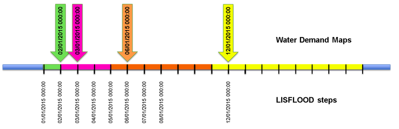

# Water use


## Introduction

This page describes the LISFLOOD water use routine, and how it is used. Water abstraction for human use can have large impact on flow conditions. If this modules is used in calibration, then it must be used also for forecast computations.

The module water use can be activated by adding the following line to the `lfoptions` element:

```xml
	<setoption choice="1" name="wateruse"/>
```


## Water demand, abstraction and consumption

LISFLOOD distinguishes between water demand, water abstraction, water consumption and return flow. Abstractions are typically higher than demands due to leakage in the public supply network, transmission and evaporation losses during irrigation water transport. For any sector, water consumption is typically lower than water demand, since only a part of the water is actually used (and hence exits the system), while the remaining fraction is returned to the system later on. The difference between water abstraction and water consumption is the water return flow. The consumptive use represents water that does not to the system after being used. LISFLOOD extracts the water demand from groundwater and surface water bodies, the consumptive use leaves the water cycle, and the remainder returns to the channels.

The water use routine considers water demand, abstraction, net consumption and return flow from various societal sectors:

-   _dom_:  use of water in the public sector, e.g. for domestic use
-   _liv_:  use of water for livestock
-   _ene_:  use of cooling water for the energy sector in thermal or nuclear power plants
-   _ind_:  use of water for the manufacturing industry
-   _irr_:  water used for crop irrigation
-   _ric_:  water used for paddy-rice irrigation

For four sectors, a NetCDF file specifies the water demand in mm/(day·pixel):
-   _dom.nc_ for domestic water demand.
-   _liv.nc_ for livestock water demand.
-   _ene.nc_ for energy-cooling water demand.
-   _ind.nc_ for manufacturing industry water demand.

Typically, water demands are related to amounts of population, livestock, Gross Domestic Product (GDP), gross value added (GVA). They can be obtained by downscaling national or regional reported data. More detailed information on the generaion of these map can be found in the [Input maps: water use](https://ec-jrc.github.io/lisflood-code/4_Static-Maps_water-use/) in the OS LISFLOOD user guide.

Paddy-rice irrigation water demand is simulated as described in the [dedicated chapter](https://ec-jrc.github.io/lisflood-model/2_17_stdLISFLOOD_paddy_rice/).
Computation of the water demand for all the other types of crops is described in this page.


### Domestic use

The amount of water demanded by the public water supply network can be obtained by downscaling national reported data with higher resolution population maps (please visit [this page](https://ec-jrc.github.io/lisflood-code/4_Static-Maps_water-use/) for a more detailed description of the methodology). A NetCDF file provides the domestic demand in mm/day for each pixel; this file is indicated in the settings file using the parameter `PrefixWaterUseDomestic`, which by default takes the value _"dom"_.

LISFLOOD considers leakages in the public supply network. The proportion of water loss in the system can be specified in the parameter $LeakageFraction$ of settings file either as a constant or as a map:

```xml
<textvar name="LeakageFraction" value="0.2">
    <comment>
    Fraction of leakage on public water supply (0=no leakage, 1=100% leakage)
        0.2
        $(PathMaps)/leakage.map
    </comment>
</textvar>
```

The leakage is often reported as an average percentage per country.
LISFLOOD also allows to account for interventions to reduce leakages compared to the current scenario: this is achieved via the input value *LeakageReductionFraction*.

$LeakageFraction$ is therefore adjusted as follows:
$LeakageFraction$ = $LeakageFraction$ * (1-$LeakageReductionFraction$)

The water demand defined in _dom.nc_ is then augmented by the leakage fraction to estimate the water abstracted to fulfill the demand:

$$DomesticWaterAbstraction = DomesticDemand · (1 + LeakageFraction)$$

Water saving strategies implemented by the households (and not included in the current use scenario) reduces the DomesticDemand, and, consequently, DomesticWaterAbstraction.

Water saving strategies are accounted for using WaterSavingFraction

$$DomesticAbstraction = DomesticDemand \cdot \left( 1 - WaterSavingFraction \right) · (1 + LeakageFraction)$$

$WaterSavingFraction$, $LeakageFraction$, and $LeakageReductionFraction$ must be provided as input to the model. The baseline value is 0, the maximum value is 1. The value of $DomesticAbstraction$ is reduced by $WaterSavingFraction$ and increased by $LeakageFraction$.

The leakage volume is considered lost due to evaporation. Consequently to the definitions above, the leakage volume is" 

$$Leakage = LeakageFraction * DomesticDemand \cdot \left( 1 - WaterSavingFraction \right)$$

It must be considered that only a fraction of the domestic water demand is consumed by the households. This fraction is the consumptive use, it is a value between 0 ans 1, and it is defined in the settings file. It can be either a constant or a map:

```xml
<textvar name="DomesticConsumptiveUseFraction" value="0.20">
    <comment>
	Consumptive Use (1-Recycling ratio) for domestic water use (0-1) [-]
	Source: EEA (2005) State of Environment
    </comment>
</textvar>
```

So, the actual:

$$DomesticConsumption = DomesticConsumptiveUseFraction \cdot DomesticDemand \cdot \left( 1 - WaterSavingFraction \right)$$

The total amount of water which leaves the system (and consequently must be subtracted from the water balance) due to domestic water use is then computed as follows:

$$DomesticConsumptiveUse = DomesticDemand \cdot \left( 1 - WaterSavingFraction \right) \cdot DomesticConsumptiveUseFraction + Leakage$$

The return flow is the difference between the domestic water abstraction and the domestic water consumptive use.
<!-- $$DomesticReturnFlow = (1 - DomesticConsumptiveUseFraction) \cdot DomesticDemand$$ -->

*The reader is advised to read the **Important note about OS LISFLOOD v5** at the bottom of this page.*

### Energy sector

Thermal powerplants generate energy through heating water, turn it into steam which spins a steam turbine that drives an electrical generator. Almost all coal, petroleum, nuclear, geothermal, solar thermal electric, and waste incineration plants, as well as many natural gas power stations are thermal, and they require water for cooling during their processing.
LISFLOOD typically reads an _ene.nc_ file that determines the water demand for the energy sector in mm/day/pixel. [This chapter](https://ec-jrc.github.io/lisflood-code/4_Static-Maps_water-use/) of the OS LISFLOOD user guide provides guidelines for the generation of such input map.

The parameter `EnergyConsumptiveUseFraction` is used to determine the consumptive water usage of thermal power plants. It can be either a constant or a map:

```xml
<textvar name="EnergyConsumptiveUseFraction" value="0.33">
    <comment>
    Consumptive Use (1-Recycling ratio) for energy water use (0-1) [-]
        $(PathMaps)/energyconsumptiveuse.nc
    </comment>
</textvar>
```

For small rivers the consumptive use varies between 1:2 and 1:3, so 0.33-0.50 (Source: Torcellini et al. (2003) "Consumptive Use for US Power Production"), while for plants close to large open water bodies values of around 0.025 are valid.

We assume no losses in the energy sector, so the demand equals the actual water abstracted. So, the actual energy consumptive use is:

$$EnergyAbstraction = EnergyDemand$$
$$EnergyConsumptiveUse = EnergyDemand \cdot EnergyConsumptiveUseFraction$$

The return flow is the difference between the water abstracted and the water consumed.  


### Manufacturing industry

The manufacturing industry also requires water for their processing, much depending on the actual product that is produced, e.g. the paper industry or the clothing industry. LISFLOOD reads an _ind.nc_ file which determines the water demand for the industry sector in mm/day/pixel. This map is derived from downscaling national reported data. [This chapter](https://ec-jrc.github.io/lisflood-code/4_Static-Maps_water-use/) provides guidelines for the generation of such input map.

An *IndustrialConsumptiveUseFraction* is used to determine the consumptive water usage of the manufacturing industry. This can either be a fixed value, or a spatial explicit map.

```xml
<textvar name="IndustrialConsumptiveUseFraction" value="0.15">
    <comment>
    Consumptive Use (1-Recycling ratio) for industrial water use (0-1)
    </comment>
</textvar>
```

The industrial consumptive use is computed as follows:

$$IndustrialWaterConsumptiveUse = IndustrialAbstraction \cdot IndustrialConsumptiveUseFraction$$

The return flow is the difference between the water abstracted and the water consumed.

*The reader is advised to read the **Important note about OS LISFLOOD v5** at the bottom of this page.*


### Livestock

Livestock also requires water. LISFLOOD reads a _liv.nc_ file which determines the water demand for livestock in mm/day/pixel. For instance, Mubareka et al. (2013) (http://publications.jrc.ec.europa.eu/repository/handle/JRC79600) estimated the water requirements for the livestock sector in Europe, based on livestock density maps for 2005.  Livestock water demand maps should account for different animal categories (e.g. cattle, pigs, poultry, and sheep and goats). [This chapter](https://ec-jrc.github.io/lisflood-code/4_Static-Maps_water-use/) of the OS LISFLOOD user guide provides guidelines for the preparation of liverstock water demand maps. 

The parameter `LivestockConsumptiveUseFraction` is used to determine the consumptive water usage of livestock. This can either be a fixed value, or a spatial explicit map.

```xml
<textvar name="LivestockConsumptiveUseFraction" value="0.15">
    <comment>
    Consumptive Use (1-Recycling ratio) for livestock water use (0-1)
    </comment>
</textvar>
```

Assuming no losses in the livestock sector, the water abstracted and the demand are equal. Therefore, the consumptive use is:

$$LivestockConsumptiveUse = LivestockConsumptiveUseFraction \cdot LivestockDemand$$

The return flow is the difference between the water abstracted and the water consumed.

*The reader is advised to read the **Important note about OS LISFLOOD v5** at the bottom of this page.*

### Crop irrigation

Crop irrigation and paddy-rice irrigation are simulated using separate model subroutines. The methodology for the modelling of paddy-rice irrigation is described [here](https://ec-jrc.github.io/lisflood-model/2_17_stdLISFLOOD_paddy_rice/). 
This page explains the computation of the water volume required by crop irrigation. 

Crop irrigation water demand is assumed equal to the difference between potential transpiration ($T_{max}$) and actual transpiration ($T_a$). The computation of $T_{max}$ and $T_a$ is described in the chapter [Water uptake by roots and transpiration](https://ec-jrc.github.io/lisflood-model/2_07_stdLISFLOOD_plant-water-uptake/). It is here reminded that $T_a$ is lower than $T_{max}$ because plant trasnpiration decreases with decreasing values of soil moisture. $T_a$ is then compared with the amount of water already available in the soil to compute the amount of water to be supplied by irrigation:

$$T_{a,irrig} = \min \left(T_a, w_1 - w_{wp1} \right)$$

where $w_1$ and $w_{wp1}$ are, respectively, the amount of water available and the wilting point. Root water uptake depletes the soil moisture of the superficial (1a) and upper (1b) soil layers. 

The demand for crop irrigation is then computed as:

$$ CropIrrigationDemand = ( T_{max} - T_{a,irrig} ) \cdot IrrigationMult$$

where $IrrigationMult$ is a non-dimensional factor generally larger than 1 having the function to account for the additional amount of water required to prevent salinisation problems.

Water abstracted for crop irrigation is larger than the water demand in order to account for the losses within the irrigation system. These losses are quantified using two non-dimensional factors, namely the $IrrigationEfficiency$ and the $ConveyanceEfficiency$. Both range between 0 and 1 and must be defined in the settings file.

```xml
<textvar name="IrrigationEfficiency" value="0.75">
    <comment>
    Field application irrigation efficiency [-]: max 1, ~0.90 drip irrigation, ~0.75 sprinkling
        Default: 0.75 [-]
        $(PathMaps)/irrigation_efficiency_baseline.nc
    </comment>
</textvar>

<textvar name="ConveyanceEfficiency" value="0.80">
    <comment>
    conveyance efficiency [-]: around 0.80 for average channel
    </comment>
</textvar>
```
Using these two parameters, the water abstraction for crop irrigation is computed as follows:

$$CropIrrigationAbstraction = \frac{CropIrrigationDemand}{IrrigationEfficiency \cdot ConveyanceEfficiency}$$

If the soil is frozen (i.e. the [$FrostIndex$](https://ec-jrc.github.io/lisflood-model/2_05_stdLISFLOOD_frost-index/) is larger than a selected threshold), water demand for crop irrigation is set to 0.

Finally, the modelling of crop irrigation includes also the option $drainedIrrigation$:
```xml
<setoption choice="1" name="drainedIrrigation"/>
```
This option acts on the portion of irrigated area defined by the value $DrainedFraction$ (between 0 and 1).
In areas with drained irrigation, seepage flow from the third soil layer by-passes groundwater and it is directly added to the sub-surface flow from the upper groundwater zone to the channels.


### Transient or constant water demand

Water demand values generally experience inter- and intra- annual variability. A parameter in the settings file allows to activate the use of water demand maps containing different values over time. 

```xml
<setoption choice="1" name="TransientWaterDemandChange"/>
```
When activated, water demand maps must be provided to LISFLOOD as a NetCDF stack (`readNetcdfStack=1`). Maps can be provided with any, even non-constant, frequency.  Water demand maps follow the same time convention as all other LISFLOOD maps: maps are stored using the timestamp from the end of the time interval they refer to. LISFLOOD will continue using the same water demand map until a new water demand map is available in the NetCDF stack (see figure below). 




**Figure:** *Use of transient water demand maps.*

Another options allows using water demands of an average year, namely a set of water demand maps for one single year that will be cycled for every year in the simulation.

```xml
<setoption choice="1" name="useWaterDemandAveYear"/>
```

When activated, water demand maps for one single year must be provided to LISFLOOD as a NetCDF stack (`readNetcdfStack=1`). Maps can be provided with any, even non-constant, frequency. LISFLOOD will continue using the same water demand map until a new water demand map is available in the NetCDF stack. The same year will be cycled over time. This option is frequently used for forecasting, when future water demand information is not available.
    
>**Note**: LISFLOOD cannot switch `useWaterDemandAveYear` on and off during the same simulation. This means it is not possible to run a continuous simulation using water demand maps for a period and an average water demand year for another period. If an average year must be used together with other water demand maps, it is necessary to create a NetCDF file containing existing water demand information and the necessary number of average years.
>
                   
## Sources of water abstraction

LISFLOOD can abstract water from groundwater or from surface water (rivers, lakes and or reservoirs), or derive it from unconventional sources, such as desalination.  

The sub-division in these three sources is achieved by creating and using the following maps (--TO DO --- please find the guidelines in this chapter):

-   fracgwused.nc (values between 0 and 1) is *FractionGroundwaterUsed*
-   fracncused.nc (values between 0 and 1) is *FractionNONconventionalSourcesUsed*

LISFLOOD automatically assumes that the remaining water ($1-FractionGroundwaterUsed-FractionNONconventionalSourcesUsed$) is derived from various sources of surface water. 

*DomesticConsumptiveUse*, *IndustrialConsumptiveUse*, and *LivestockConsumptiveUse* can be supplied by groundwater, non-conventional water sources, and surface water. Water resources allocation is computed as follows:

$$DomesticAbstractionGW = FractionGroundwaterUsed \cdot DomesticWaterConsumptiveUse$$
$$DomesticAbstractionNONconv= FractionNONconventionalSourcesUsed \cdot DomesticWaterConsumptiveUse$$
$$DomesticAbstractionSurfaceWater = DomesticWaterConsumptiveUse - DomesticWaterAbstractionGW  - DomesticAbstractionNONconv$$

$$IndustrialAbstractionGW = FractionGroundwaterUsed \cdot IndustrialConsumptiveUse$$
$$IndustrialAbstractionNONconv= FractionNONconventionalSourcesUsed \cdot IndustrialConsumptiveUse$$
$$IndustrialAbstractionSurfaceWater = IndustrialConsumptiveUse - IndustrialAbstractionGW - IndustrialbstractionNONconv$$

$$LivestockAbstractionGW = FractionGroundwaterUsed \cdot LivestockConsumptiveUse$$
$$LivestockAbstractionNONconv= FractionNONconventionalSourcesUsed \cdot LivestockConsumptiveUse$$
$$LivestockAbstractionSurfaceWater = LivestockConsumptiveUse - LivestockAbstractionGW - LivestockAbstractionNONconv$$

$CropIrrigationibstraction$ is supplied by groundwater and surface water:

$$CropIrrigationAbstractionGW = FractionGroundwaterUsed \cdot CropIrrigationAbstraction$$
$$CropIrrigationAbstractionSurfaceWater = CropIrrigationAbstraction - CropIrrigationAbstractionGW$$

$EnergyConsumpttiveUse$ is supplied exclusively by surface water:

$$EnergyAbstractionSurfaceWater = EnergyConsumptiveUse$$

[*RiceIrrSurfWaterAbstr*](https://ec-jrc.github.io/lisflood-model/2_17_stdLISFLOOD_paddy_rice/) is supplied exclusively by surface water.

Surface water sources for abstraction may consist of lakes, reservoirs, and rivers. The definition of the contribution of each surface water body is explained in the paragraph [*Surface water abstractions from reservoirs, lakes, and rivers*](#Surface-water-abstractions).

### Water regions  

When using a relarively coarse resolution model (e.g. 0.5 degrees), it is reasonable to assume that the water demand in a pixel is supplied by the water resources in that same pixel. However, as the spatial resolution of the model increases, the assumption of coincidence between demand and abstraction locations within the same model grid cell becomes increasingly invalid. When using finer spatial resolutions, the water demand of a pixel could be supplied by another pixel nearby (that is, water demand and water abstraction actually occur in different pixels). To address this limitation, the concept of water regions is introduced. A *water region* is defined as the area encompassing the locations of both water demand and abstraction, allowing for a more accurate representation of the spatial relationships between these processes.

*Water regions* are generally defined by sub-river-basins within a Country. In order to mimick reality, it is advisable to avoid cross-Country-border abstractions. Whenever information is available, it is strongly recommended to align the *water regions* with the actual areas managed by water management authorities, such as regional water boards. In Europe, the River Basin Districts, as defined in the Water Framework Directive and subdivided by country, can be used.

*Water regions* are activated by adding the following line to the `lfoptions` element to the LISFLOOD settings file:

```xml
	<setoption choice="1" name="wateruseRegion"/>
```
[This chapter](https://ec-jrc.github.io/lisflood-code/4_Static-Maps_water-use/) of the OS LISFLOOD user guide provides guidelines for the preparation of the map.

### Groundwater

The total amount of water that is required from groundwater resources is:

$$TotalAbstractionFromGroundWater = DomesticAbstractionGW  + IndustrialAbstractionGW  + LivestockAbstractionGW + CropIrrigationAbstractionGW$$

LISFLOOD subtracts groundwater from the Lower Zone (LZ).

>**Note**. In the current LISFLOOD version, no limits are set for groundwater abstraction, meaning that LZ relative levels can become negative.

Groundwater depletion can be examined by monitoring the LZ levels between the start and the end of a simulation. Given the intra- and inter-annual fluctuations of LZ, it is advisable to extend the monitoring period to at least a decade.

Groundwater lower zone generally contribute to rivers baseflow.
If LZ level decreases below the value $LZ_{Threshold}$ [mm], the flow from the lower zone to the nearby rivers (i.e. the baseflow) stops. When sufficient recharge is added to raise LZ levels above the threshold, baseflow starts again. This mimics the behaviour of some river basins in very dry episodes, where aquifers temporarily lose their connection to major rivers and base-flow is reduced. The value $LZ_{Threshold}$ is generally identified via calibration. Note that large negative values ensure that there is always baseflow.

```xml
<textvar name="LZThreshold" value="$(PathMaps)/lzthreshold.nc">
    <comment>
    Water storage [mm] in the lower groundwater zone below which baseflow stops,
    i.e., the flow from the lower groundwater zone into the river
    threshold value [mm] of the water storage in the lower groundwater zone.
    </comment>
</textvar>
```

When groundwater is abstracted for usage, it typically could cause a local dip in the LZ values (~ water table) compared to neigbouring pixels. 
The option $groundwaterSmooth$ roughly mimicks groundwater flow as it evens out the groundwaterlevels with neighbouring pixels. This option can be switched on using:

```xml
	<setoption choice="1" name="groundwaterSmooth"/>
```
>**Note**. The use of the option $groundwaterSmooth$ is not consistent with a calibration approach based on top-down intercatchemnets, where parameters are optimized independently for each catchment when moving from upstream to downstream. When using this type of calibration approach, the option must be off.  


### Non-Conventional sources: desalination

Water obtained through desalination is the most common type of non-conventional water usage. It will likely only be active near coastal zones, since transportation costs are too high, otherwise. The amount of desalinated water usage in LISFLOOD is defined using the factor $FractionNONconventionalSourcesUsed$. 
It is assumed that the non-conventional water demand is always available. It is abstracted for a 100%, so no losses are accounted for.
The total amount of water supplied by non-conventional sources is:

$$TotalAbstractionFromNonConventionalSources = DomesticAbstractionNONconv  + IndustrialAbstractioNONconv + LivestockAbstractionNONconv$$


### Surface water

The total amount of water to be abstracted by surface water bodies is:

$$TotalAbstractionFromSurfaceWater = DomesticAbstractionSurfaceWater  + IndustrialAbstractionSurfaceWater + LivestockAbstractionSurfaceWater + EnergyAbstractionSurfaceWater + CropIrrigationAbstractionSurfaceWater + RiceIrrSurfWaterAbstr$$


#### Abstractions from lakes and reservoirs

Lakes and reservoirs can supply part of the surface water abstraction. The parameter $FractionLakeReservoirWaterUsed$ defines the fraction of surface water abstraction which should be supplied by lakes and reservoirs. The value of this parameter (between 0 and 1) is provided as input to the model through the settings file.

```xml
<textvar name="FractionLakeReservoirWaterUsed" value="0.25">
<comment>
lake and reservoir water used, fraction of a pixel (0-1)
</comment>
</textvar>
```

LISFLOOD then computes the available water volume in lakes and reservoirs. The available water volume of a lake is defined equal to the 10% of its total storage volume at that specific computational step. The available water volume in a reservoir is assumed equal to the minimum between the 1% of its [total storage capacity](https://ec-jrc.github.io/lisflood-model/3_03_optLISFLOOD_reservoirs/) and the 2% of the volume currently [stored in the reservoir](https://ec-jrc.github.io/lisflood-model/3_03_optLISFLOOD_reservoirs/) at the computational time step. These conditions are imposed to constantly preserve a reasonable amount of water in reservoirs and lakes. The total water volume which can be potentially abstracted from reservoirs and lakes is then:

$$TotalAvailableVolumeLakesReservoirs = AvailableVolumeLakes + AvailableVolumeReservoirs$$

It is here reminded that all the lakes and reservoirs within the same *water region* are considered for the computation of the available water volume. Similarly, the water demand is computed by considering the whole water region.

The volume which is actually abstracted from lakes and reservoirs within a *water region* is then given by:

$$WaterAbstractedLakesReservoirs = \min \left(TotalAvailableVolumeLakesReservoirs, FractionLakeReservoirWaterUsed \cdot TotalAbstractionFromSurfaceWater \right)$$

The quantities below are then subtracted from the [lake storage](https://ec-jrc.github.io/lisflood-model/3_02_optLISFLOOD_lakes/) and the [reservoir storage](https://ec-jrc.github.io/lisflood-model/3_03_optLISFLOOD_reservoirs/):

$$WaterAbstractedLakes = \frac{WaterAbstractedLakesReservoirs}{TotalAvailableVolumeLakesReservoirs} \cdot AvailableVolumeLakes$$

$$WaterAbstractedReservoirs = \frac{WaterAbstractedLakesReservoirs}{TotalAvailableVolumeLakesReservoirs} \cdot AvailableVolumeReservoirs$$


#### Abstraction from rivers and environmental flow

The remaining water abstraction volume is demanded to the rivers. The amount of water that *should be* extracted from the rivers is computed by:

$$WaterToBeAbstractedChannels = TotalAbstractionFromSurfaceWater - WaterAbstractedLakesReservoirs$$

The water to be abstracted from channels is withdrawn from discharge in the river network within the same *water region*. Moreoever, since the exact locations of abstractions are typically not known, river water abstractions are assumed to be homogeneously distributed within the *water region*.

River discharge at each time step $Q_{ch}$ is computed by the [routing module](https://ec-jrc.github.io/lisflood-model/2_16_stdLISFLOOD_channel-routing/). 

A minimum amount of water must always flow in a river. This value is the *environmental flow threshold*, which is imposed by the user in the settings file:

```xml
<textvar name="EFlowThreshold" value="$(PathMaps)/eflow.nc">
    <comment>
    Environmental flow threshold [m3/s] below which water abstraction stops.
    E.g. the 10th percentile discharge of the baseline run, that is a multi-decade "natural" run 
    </comment>
</textvar>
```

The 10th percentile discharge from a 'natural' run for at least a few decades can be used to define the environmental flow threshold. In order to mimick natural flow conditions, a 'natural' run does not include neither reservoirs nor human water abstractions. LISFLOOD also counts the number of days in which the channel flow is lower than the *environmental flow threshold* as this piece of information is important for water resources and ecosystem management.

The water volume which can be potentially abstracted from the river within a *water region* is then:

$$AvailableVolumeChannels = \max \left( ( Q_{ch} - EFlowThreshold ) \cdot \Delta t , 0 \right)$$

The amount of water extracted from the rivers is:

$$WaterAbstractedFromChannels = \min \left(AvailableVolumeChannel, WaterToBeAbstractedChannels \right)$$

A condition in which *WaterAbstractedFromChannels* is lower than *WaterToBeAbstractedChannels* means that the sum of the water abstractions from groundwater, non-convential sources, and surface water is lower than the total water abstraction demand. The amount of water which was requested but could not be supplied is the *WaterUseShortage* and it is quantified as follows:

$$WaterUseShortage =  WaterToBeAbstractedChannels - WaterAbstractedFromChannels$$


In condition of water scarcity, water uses are satisfied according to the following order of importance: domestic, energetic, livestock, industry, and irrigation. The latter sentence implies that when $WaterUseShortage \gt 0$, LISFLOOD reduces the water volume delivered to the irrigated fields. Specifically, the amount *WaterUseShortage* is subtracted from the total amount of water required from surface channels by irrigated fields (excluding paddy rice irrigation), meaning that the total amount of water effectively supplied to the irrigated fields is:

$$IrrigationWater = CropIrrigationAbstractionGW  + CropIrrigationAbstractionSurfaceWater - WaterUseShortage$$

The value *IrrigationWater* is then used to compute the water content of the superficial soil layer ($w_{1a}$) and the upper soil layer ($w_{1b}$). Specifically, the value *IrrigationWater* (after convertion in [mm]) is first added to the superficial soil layer, until the water content of this layer ($w_{1a}$) is equal to:

$$w_{fill,1a} = \min \left( w_{crit,1a}, w_{pF3,1a} \right)$$

where $w_{crit,1a}$ is the [critical](https://ec-jrc.github.io/lisflood-model/2_07_stdLISFLOOD_plant-water-uptake/) amount of moisture below which water uptake is reduced and plants start closing their stomata, and $w_{pF3,1a}$ is the lower boundary of the water content which is rapidly available for root water uptake (pF=1000 hPa). The remainder amount of water (if any) is then added to the upper soil layer ($w_{1b}$). Finally, the [actual transpiration rate](https://ec-jrc.github.io/lisflood-model/2_07_stdLISFLOOD_plant-water-uptake/) ($T_a$) is updated to account for the soil moisture deficit due to the irrigation shortage.

In order to check the conservation of mass within the system, LISFLOOD computes the amount of water consumed by irrigation *IrriLossCum* (this amount of water exits the system): this value accounts for the irrigation water abstracted from groundwater, the irrigation water effectively abstracted from surface water, the amount of water returned to the system due to leakages and losses (defined by the factors *IrrigationEfficiency* and *ConveyanceEfficiency*), the resulting water content of the superficial and upper soil layers.


## Output files

The water use routine produces a variety of output maps and indicators, a few examples are listed in the table below.

 ***Table:*** *Output of water use routine.*     

| file       | short description                         | time  | area   | unit      | long description                                        |
| ---------- | ----------------------------------------- | ----- | ------ |---------- | ------------------------------------------------------- | 
| _EFlowIndicator.nc_ | eflow breach indicator (1=breached)       | dt   | pixel  | 0 or 1    | number of days that the environmental flow is breached  |
| _onsumption_required_domestic_M3MonthRegion.nc_ | domestic consumption       | month   | water region  | m3  | domestic consumptive user per month, per water region  |
| _TotalAbstractionFromGroundwaterM3.nc_ | total abstraction from groundwater                   |dt | pixel |	m3        |	total abstraction from groundwater resources                                |
| _TotalAbstractionFromSurfaceWaterM3.nc_ |  total abstraction from surface water                 |dt |pixel  |	m3        |	 total abstraction from surface water                            |
| _RegionMonthWaterAbstractedfromLakesReservoirsM3.nc_ |  Reservoir and Lake abstraction in m3                  |month | water region  |	m3        |	 Reservoir and Lake abstraction in m3                               |
| _Fk1.nc_ 	 | Falkenmark 1 index (local water only)     | month |region  |	m3/capita |	water availability per capita (local water only)        |
| _Fk3.nc_   | Falkenmark 3 index (external inflow also) | month | region | m3/capita | water availability per capita (local water + external inflow)|
| _IrSh.nc_  | water shortage                            | month | region | m3        | water shortage due to availability restrictions         |
| _WDI.nc_   | Water Dependency Index	                 | month | region | fraction  | local water demand that cannot be met by local water / total water demand|
| _WSI.nc_  |  Water Security Index      | month | region |	fraction  |Upstream Inflow Actually Used / Upstream Inflow Available     |
| _WTI.nc_  | Water Sustainability Index| month | region | fraction  | 1-SurfaceWaterDeficit / TotalWaterDemand     |


#### Important note about OS LISFLOOD v5: domestic, industrial; livestock consumptive use
A patch solution has been implemented in LISFLOOD v5 to avoid spurious results.
A explained in this page, OS LISFLOOD can abstract water from surface water bodies (lakes, reservoirs, river channels) and groundwater. While water abstraction from surface water  bodies stops whethe avialble water volume is lower than a pre-defined threshold, in the current LISFLOOD version, no limits are set for groundwater abstraction, meaning that LZ relative levels can become increasingly negative (which means that groundwater resources have no limits). In some circumstances (e.g. areas were water abstraction is frequently limited by groundwater availability), return flow generated a spurious increase of water volume in the channels. To avoid the issue of spurious return flow, in LISFLOOD v5, water abstraction for domestic use is imposed equivalent to water consumptio (the model extracts from groundwater only the water volume actually consumed, to avoid the risk of spurious or highly overestimated return values).
Clearly, the assumption of infinite groundwater resources also implies possible understimation of water scarcity conditions.
While these limitations could be solved in future model releases, it is of paramount importance for OS LISFLOOD users to be aware of this limitations in the interpreation of model results in relation to water use and water scarcity conditions.
Fnally, it is noted that the energy sector is not included in the list above because energy sector water supply is only provided by surface water resources (no return flow from groundwater to surface water).

[🔝](#top)

