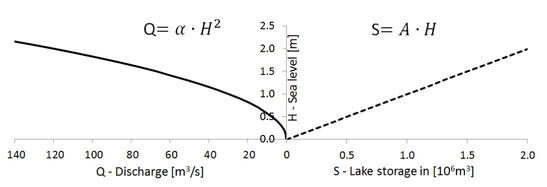

## Lakes


### Introduction

This page describes the LISFLOOD lake routine, and how it is used. The simulation of lakes is *optional*, and it can be activated by adding the following line to the 'lfoptions' element in the LISFLOOD settings file:

```xml 
	<setoption name="simulateLakes" choice="1" />
```

Lakes can be simulated on channel pixels where kinematic wave routing is used. The routine does *not* work for channel stretches where the dynamic wave is used!

### Description of the lake routine

Lakes are simulated as points in the channel network. The figure below shows all computed in- and out-going fluxes. Lake inflow equals the channel flow upstream of the lake location. Lake evaporation occurs at the potential evaporation rate of an open water surface.


***Figure:*** *Schematic overview of the simulation of lakes.* $H_0$ *is the water level at which the outflow is zero;* $H$ *is the water level in the lake and* $EW$ *is the evaporation from the lake*

Lake retention can be seen as a special case of flood retention with horizontal water level. Therefore the basic equations of channel routing can be written as:

$$Q_{in}(t) - Q_{out}(t) = \frac{\Delta S}{\Delta t}$$

$$\frac{Q_{in1} + Q_{in2}}{2} - \frac{Q_{out1} + Q_{out2}}{2} = \frac{S_2-S_1}{\Delta t}$$

Where:
   <br>$Q_{in1}$:  Inflow to lake at time $1$ ($t$)
   <br>$Q_{in2}$:  Inflow to lake at time $2$ ($t+\Delta t$)
   <br>$Q_{out1}$:  Outflow from lake at time $1$ ($t$)
   <br>$Q_{out2}$:  Outflow from lake at time $2$ ($t+\Delta t$)
   <br>$S_1$: Lake storage at time 1 ($t$)
   <br>$S_2$: Lake storage at time 2 ($t+\Delta t$)

Simply stated, the change in storage is equal to inflow minus outflow. To solve this equation we require the lake storage curve $S=f(H)$ and the rating curve $Q_{out}=f(H)$. Lake storage and discharge have to be linked to each other by the water depth (see figure).



***Figure:*** *Relation between water depth, lake outflow and lake storage*    

#### Modified Puls Approach (see also Maniak, 1997)

The modified Puls approach suggests rewriting the equation above as follows:

$$\frac{S_2}{\Delta t} + \frac{Q_{out2}}{2} = \frac{S_1}{\Delta t} + \frac{Q_{in1} + Q_{in2} - Q_{out1}}{2} = SI$$

All the terms in the right-hand side of this equation ($SI$) are known, since $S_1$, $Q_{out1}$ and $Q_{in1}$ are given by the previous timestep, and $Q_{in2}$ is the computed inflow to the lake at the current timestep.

For the left term two assumptions are made here to simplify and speed up the solution of the modified Puls approach:

1.  The outflow of the lake is based on a modification of Poleni's equation for rectangular weir (Bollrich & Preißler, 1992): 
$$Q = \frac{2}{3} \cdot c \cdot b \sqrt{2g}  H^{3/2}$$
    Assuming the weir is not rectangular, but parabolic, we can simplify this equation to:
$$Q = \alpha \cdot H^2$$
    where:
      <br>$Q$:  outflow discharge,
      <br>$H$:  lake water depth,
      <br>$\alpha$: parameter that combines channel width ($b$), gravity ($g$) and weir coefficient ($c$).

    The parameter $\alpha$ is a calibration coeffient. Specifically, it is computed as follows: $\alpha = \alpha_1 \cdot \alpha_{Mult}$, where   $\alpha_1$ is a first estimate of the value of $\alpha$ **(often equal to the width of the lake outlet)** and $\alpha_{Mult}$ is defined during calibration.

2.  The best approach for a sea level vs. lake storage function would be a lookup table. LISFLOOD assumes instead a linear approach as a simplification: 
$$S = A \cdot H$$
    where:
      <br>$S$: lake storage [$m^3$]
      <br>$A$: lake area [$m^2$]
      <br>$H$: lake water depth [$m$]

Replacing $S$ and subsequently $H$ according to the previous two assumptions, the equation becomes:

$$
SI = \frac{S_2}{\Delta t} + \frac{Q_{out2}}{2} = \frac{A \cdot H}{\Delta t} + \frac{Q_{out2}}{2} = \frac{A \cdot \sqrt{Q_{out2}}}{\Delta t \cdot \sqrt{\alpha}} +\frac{Q_{out2}}{2}
$$

The equation above can be solved as a quadratic equation for $\sqrt{Q_{out2}}$.

$$SI = \frac{A}{\Delta t \cdot \sqrt{\alpha}} \cdot \sqrt{Q_{out2}} + \frac{1}{2} \cdot Q_{out2}$$
$$SI = LakeFactor \cdot \sqrt{Q_{out2}} + \frac{1}{2} \cdot Q_{out2}$$

Its solution is:

$$Q_{out2} = \left( -LakeFactor + \sqrt{LakeFactor^2 + 2 \cdot SI} \right)^2$$

Where:
   <br>$LakeFactor = \frac{A}{\Delta t \cdot \sqrt{\alpha}}$
   <br>$SI = \frac{S_1}{\Delta t} + \frac{Q_{in1} + Q_{in2} - Q_{out1}}{2}$

### Initialisation of the lake routine

Because lakes (especially large ones) tend to produce a relatively slow response over time, it is important to make sure that the initial lake level is set to a more or less sensible value. LISFLOOD has two options for the initial value:

1.  The initial state of the lake can be set using the parameter `LakeInitialLevelValue`, either as a value or as a map from a previous run.

2.  If `LakeInitialLevelValue` is set to `-9999`, the initial lake level will be calculated from a steady-state net-lake inflow \[$m^3/s$\]. The steady-state net-lake inflow is given by a table called 'TabLakeAvNetInflowEstimate'. In this table, the average net inflow (inflow minus lake evaporation) is listed. The average net inflow can be estimated using measured discharge and evaporation records. If measured discharge is available just downstream of the lake (i.e. the outflow), the (long-term) average outflow can be used as an estimation of the net inflow, since inflow equals outflow for a steady state situation. If only inflow is available, all average inflows should be summed, and the average lake evaporation should be subtracted from this figure.

Here a worked example. Be aware that the calculation can be less straightforward for very large lakes with multiple inlets (which are not well represented by the current point approach anyway):
   
#### EXAMPLE: Calculation of average net lake inflow

 Lake characteristics 
 - lake area: $2.15 \cdot 10^8\ m^2$                                            
 - mean annual discharge downstream of lake: $293\ \frac{m^3}{s}$             
 - mean annual discharge upstream of lake: $300\ \frac{m^3}{s}$               
 - mean annual evaporation: $1100\ \frac{mm}{yr}$ 

<u>METHOD 1: USING AVERAGE OUTFLOW</u>                                   
Assuming lake is in quasi steady-state:                               
$averageNetInflow = averageNetOutflow = 293 \frac{m^3}{s}$                                                  

<u>METHOD 2: USING AVERAGE INFLOW AND EVAPORATION</u>                    
Only use this method in case that outflow data is not available.                 

1. Compute yearly lake evaporation in $m^3 s^{-1}$:
 
$EW[\frac{m^3}{s}] = EW[\frac{m}{yr}] \cdot A[m^2] = 1100\ \frac{mm}{yr} \cdot \frac{1}{1000·3600·24·365}\ \frac{m·yr}{mm·s} \cdot 2.15 \cdot 10^8\ m^2 = 7.5\ \frac{m^3}{s}$

2.  Compute net inflow:
 
$averageNetInflow = 300 \frac{m^3}{s} \ - 7.5\ \frac{m^3}{s}= 292.5\ \frac{m^3}{s}$

### Preparation of input data

The lake locations are defined on a (nominal) map called '*lakes.nc*'. It is important that all lakes are located on a channel pixel (you can verify this by displaying the lake map on top of the channel map). Also, since each lake receives its inflow from its upstream neighbouring channel pixel, you may want to check if each lake has any upstream channel pixels at all (if not, the lake will just gradually empty during a model run!). The lake characteristics are described by 3 tables. The following table lists all required input:

***Table:***  *Input requirements lake routine.*                                                                              

| **Maps**                   | **Default name** | **Description**                  | **Units** | **Remarks**                           |
| -------------------------- | ---------------- | -------------------------------- | --------- | ------------------------------------- |
| LakeSites                  | lakes.map        | lake locations                   | -         | nominal                               |
| **Tables**                 |                  |                                  |           |                                       |
| TabLakeArea                | lakearea.txt     | lake surface area                | $m^2$     |                                       |
| TabLakeA                   | lakea.txt        | lake joined parameter $\alpha$   | $m/s$     |                 |
| TabLakeAvNetInflowEstimate | lakeavinflow.txt | Net inflow ($=I_l - EW_l$)       | $m^3/s$   |                                  |


<u>Note:</u> When you create the map with the lake locations, pay special attention to the following: if a lake is located on the most downstream cell (i.e. the outflow point, see Figure below), the lake routine may produce erroneous output. In particular, the mass balance errors cannot be calculated correctly in that case. The same applies if you simulate only a sub-catchment of a larger map (by selecting the subcatchment in the mask map). This situation can usually be avoided by extending the mask map by one cell in downstream direction.


***Figure:***  *Placement of the lakes: lakes on the outflow point (left) result in erroneous behavior of the lake routine.*

### Preparation of settings file

All in- and output files need to be defined in the settings file. If you are using a default LISFLOOD settings template, all file definitions are already defined in the **`lfbinding`** element. Just make sure that the map with the lake locations is in the "maps" directory, and all tables in the "tables" directory. If this is the case, you only have to specify the initial lake level and --if you are using the steady-state option- the mean net lake inflow (make this a map if you're simulating multiple lakes simultaneously). Both can be set in the 'lfuser' element. *LakeInitialLevelValue* can be either a map or a single value. Setting *LakeInitialLevelValue* to *-9999* will cause LISFLOOD to calculate the steady-state level. So we add this to the 'lfuser' element (if it is not there already):

```xml
	<group>                                                             	
	<comment>                                                           	
	**************************************************************               	
	LAKE OPTION                                                           	
	**************************************************************               	
	</comment>                                                          	
	<textvar name="LakeInitialLevelValue" value="-9999">            	
	<comment>                                                           	
	Initial lake level [m]                                              	
	-9999 sets initial value to steady-state level                        	
	</comment>                                                          	
	</textvar>                                                          	
	<textvar name="TabLakeAvNetInflowEstimate" value="$(PathTables)/lakeavinflow.txt">          	
	<comment>                                                           			
	Estimate of average net inflow into lake (=inflow -- evaporation) [cu m / s]                                                          
	Used to calculated steady-state lake level in case LakeInitialLevelValue is set to -9999                                                       
	</comment>                                                          	
	</textvar>                                                          	
	</group>                                                            	
```

In the **`lfbinding`** section of the setting file:

```xml
  <group>
  <comment>
  **************************************************************
  LAKES
  **************************************************************
  </comment>
  <textvar name="LakeSites" value="$(PathMaps)/lakes.map">
  <comment>
  Map with location of lakes
  </comment>
  </textvar>
  
  <textvar name="LakeInitialLevelValue" value="$(LakeInitialLevelValue)">
  <comment>
  Initial lake level [m]
  -9999 sets initial value to steady-state level
  </comment>
  </textvar>
  
  <textvar name="TabLakeAvNetInflowEstimate" value="$(TabLakeAvNetInflowEstimate)">
  <comment>
  Estimate of average net inflow into lake (=inflow - evaporation) [cu m / s]
  Used to calculated steady-state lake level in case LakeInitialLevelValue
  is set to -9999
  </comment>
  </textvar>
  
  <comment>
  Input tables
  </comment>

  <textvar name="TabLakeArea" value="$(PathTables)/lakearea.txt">
  <comment>
  Lake surface area [sq m]
  </comment>
  </textvar>

  <textvar name="TabLakeA" value="$(PathTables)/lakea.txt">
  <comment>
  Lake parameter A
  </comment>
  </textvar>

  <comment>
  Output time series
  </comment>

  <textvar name="LakeInflowTS" value="$(PathOut)/qLakeIn.tss">
  <comment>
  Output timeseries file with lake inflow [cu m /s]
  </comment>
  </textvar>

  <textvar name="LakeOutflowTS" value="$(PathOut)/qLakeOut.tss">
  <comment>
  Output timeseries file with lake outflow [cu m /s]
  </comment>
  </textvar>
  
  <textvar name="LakeEWTS" value="$(PathOut)/EWLake.tss">
  <comment>
  Output timeseries file with lake evaporation [mm/ time step]
  </comment>
  </textvar>
  
  <textvar name="LakeLevelTS" value="$(PathOut)/hLake.tss">
  <comment>
  Output timeseries file with lake level [m]
  </comment>
  </textvar>
  
  <textvar name="LakeLevelState" value="$(PathOut)/lakh">
  <comment>
  Output map(s) with lake level [m]
  </comment>
  </textvar>

  </group>
```

Finally, you have to tell LISFLOOD that you want to simulate lakes! To do this, add the following statement to the **`lfoptions`** element:

```xml
<setoption name="simulateLakes" choice="1" />
```

Now you are ready to run the model. If you want to compare the model results both with and without the inclusion of lakes, you can switch off the simulation of lakes either by:

- Removing the '*simulateLakes*' statement from the `lfoptions` element, or
- changing it into `<setoption name="simulateLakes" choice="0" />`

Both have exactly the same effect. You don't need to change anything in either `lfuser` or `lfbinding`; all file definitions here are simply ignored during the execution of the model.

### Lake output files

The lake routine produces 4 additional time series and one map (or stack), as listed in the following table:

**Table:**  *Output of lake routine.*

| Maps            | Default name | Description                    | Units           |
| --------------- | ------------ | ------------------------------ | --------------- |
| LakeLevelState  | lakhxxxx.xxx | lake level at last time step | $m$             |
| **Time series** |              |                                |                 |
| LakeInflowTS    | qLakeIn.tss  | inflow into lakes              | $\frac{m^3}{s}$ |
| LakeOutflowTS   | qLakeOut.tss | flow out of lakes              | $\frac{m^3}{s}$ |
| LakeEWTS        | EWLake.tss   | lake evaporation               | $mm$            |
| LakeLevelTS     | hLake.tss    | lake level                     | $m$             |

Note that you can use the map with the lake level at the last time step to define the initial conditions for a succeeding simulation, e.g.:

```xml
<textvar name="LakeInitialLevelValue" value="/mycatchment/lakh0000.730">
```

[🔝](#top)

