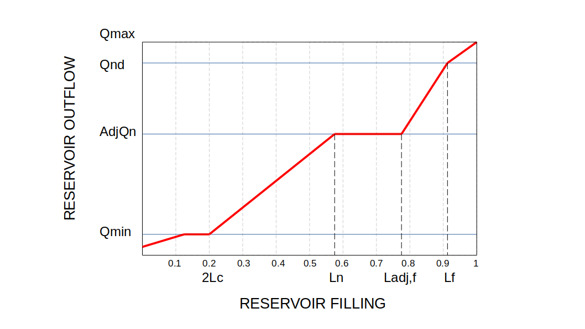

## Reservoirs

### Introduction

This page describes the LISFLOOD reservoirs routine, and how it is used. The simulation of reservoirs is *optional*, and it can be activated by adding the following line to the 'lfoptions' element:

```xml
	<setoption name="simulateReservoirs" choice="1" />
```

Reservoirs can be simulated on channel pixels where kinematic wave routing is used. The routine does *not* work for channel stretches where the dynamic wave is used!

### Description of the reservoir routine 

Reservoirs are simulated as points in the channel network. The inflow into each reservoir, $I_{res} [\frac{m^3}{s}]$, equals the channel flow upstream of the reservoir. Operational rules for reservoirs are not included implicitly in LISFLOOD, but the model mimics them by using a number of rules which define reservoir output as a function of the relative filling. The relative filling of a reservoir, $F$, is the ratio between the water volume stored in the reservoir at a computational time, $V_t\ [m^3]$, and its total storage capacity, $S\ [m^3]$:

$$
F = \frac{V_t}{S} \\
0 \le F \le 1
$$

There are three _special_ relative filling levels:
- The _conservative storage limit_, $L_c$, is the lower limit of reservoir water storage (reservoirs are never completely empty).
- The _flood storage limit_, $L_f$, is the upper limit of the operational relative filling (reservoirs are never filled completly for safety reasons).
- The _normal storage capacity_, $L_n$, is the available capacity of a reservoir. It is a value in between $L_f$ and $L_c$. 

Three discharge values define the way the outflow $[\frac{m^3}{s}]$ of a reservoir is regulated. 
- The _minimum outflow_, $Q_{min}$, is the lowest discharge that is maintained for e.g. ecological reasons. 
- The _non-damaging outflow_, $Q_{nd}$, is the maximum possible outflow that will not cause problems downstream.
- The _normal outflow_, $Q_{norm}$, is the one valid when the reservoir is within its _normal storage_ filling level.

The previous six parameters ($L_c$,$L_f$, $L_n$, $Q_{min}$, $Q_{nd}$, $Q_{norm}$) are input data.

There are two non-dimensional calibration parameters that modulate how the reservoir behaves when its normal filling ($L_n$) is exceeded. 

* $AdjL_n$ defines a new filling level in between $L_n$ and $L_f$. Therefore, it can assume values between 0.01 and 0.99.
$$
L_{adj,f} = L_n + AdjL_n \cdot (L_f - L_n)
$$
* $ResMultQ_{norm}$ defines the outflow at the previous $L_{adj,f}$ filling level. It can assume values between 0.25 and 2.
$$
AdjQ_{norm} = ResMultQ_{norm} \cdot Q_{norm} \\
Q_{min} \lt AdjQ_{norm} \lt Q_{nd}
$$

The outflow, $Q_{res} \; [\frac{m^3}{s}]$, depends on the reservoir relative filling:

$$
Q_{res} = \begin{cases} \\
\min\left(Q_{min}, \; \frac{S}{\Delta t_{day}}\right) & if \; F \le 2 \cdot L_c \\
Q_{min} + \left( AdjQ_{norm}  - Q_{min} \right) \cdot \frac{F - 2 \cdot L_c}{L_n - 2 \cdot L_c} & if \; 2 \cdot L_c \lt F \le L_n \\
AdjQ_{norm} & if \; L_n \lt F \le  L_{adj,f} \\
AdjQ_{norm}  + \frac{F - L_{adj,f}}{L_f - L_{adj,f}} \cdot (Q_{nd} - AdjQ_{norm}) & if \; L_{adj,f} \lt F \le L_f \\
\max \left( \left( F - L_f -0.01 \right) \cdot \frac{S}{\Delta t_{day}} , \; Q_{max} \right) & if \; F \gt L_f \\
\end{cases}
$$
where $\Delta t_{day}$ is equal to 86400 s, and
$$
Q_{max} = \min \left( Q_{nd} , \; \max \left( 1.2 \cdot I_{res} , \, AdjQ_{norm} \right) \right)
$$

Finally, the following condition prevents the outflow from being too large compared to the inflow. If $(Q_{res} \gt 1.2 \cdot I_{res})$ and $(Q_{res} \gt AdjQ_{norm})$ and $(F \lt L_f)$, then:
$$
Q_{res} = \max \left( \left( F - L_f - 0.01 \right) \cdot \frac{S}{\Delta t_{day}} , \; Q_{reg} \right)
$$
where
$$
Q_{reg} = \min \left( Q_{nd} , \; \max \left( 1.2 \cdot I_{res} , \, AdjQ_{norm} \right) \right)
$$

Summary of symbols:
<br>&nbsp;&nbsp;&nbsp;&nbsp;$S$:		Reservoir storage capacity $[m^3]$
<br>&nbsp;&nbsp;&nbsp;&nbsp;$F$:		Reservoir relative filling (1 at total storage capacity) \[-\]
<br>&nbsp;&nbsp;&nbsp;&nbsp;$L_c$:	Conservative storage limit \[-\]
<br>&nbsp;&nbsp;&nbsp;&nbsp;$L_n$:	Normal storage limit \[-\]
<br>&nbsp;&nbsp;&nbsp;&nbsp;$L_f$:	Flood storage limit \[-\]
<br>&nbsp;&nbsp;&nbsp;&nbsp;$Q_{min}$:	Minimum outflow $[\frac{m^3} {s}]$
<br>&nbsp;&nbsp;&nbsp;&nbsp;$Q_{norm}$:	Normal outflow $[\frac{m^3} {s}]$
<br>&nbsp;&nbsp;&nbsp;&nbsp;$Q_{nd}$:	Non-damaging outflow  $[\frac{m^3} {s}]$
<br>&nbsp;&nbsp;&nbsp;&nbsp;$I_{res}$:	Reservoir inflow $[\frac{m^3} {s}]$
<br>&nbsp;&nbsp;&nbsp;&nbsp;$AdjL_n$:	calibration parameter used to modulate $L_n$ \[-\]
<br>&nbsp;&nbsp;&nbsp;&nbsp;$ResMultQ_{norm}$:	calibration parameter used to modulate $Q_{norm}$ \[-\]

**The reservoir outflow is calculated using the same computational time interval used for the channel routing.**



***Figure:*** *Schematic of the reservoirs routine.*

### Preparation of input data 

For the simulation of reservoirs a number of additional input files are necessary. 

1. The locations of the reservoirs are defined on a (nominal) map called *res.map*. It is important that all reservoirs are located on a channel pixel (you can verify this by displaying the reservoirs map on top of the channel map). Also, since each reservoir receives its inflow from its upstream neighbouring channel pixel, you may want to check if each reservoir has any upstream channel pixels at all (if not, the reservoir will gradually empty during a model run!). 
2. The management of the reservoirs is described by 7 tables. Each of these tables (text files) should contain as many lines as reservoirs, and each line contains two columns (tab separated) with the reservoir ID and the value of the corresponding characteristic. An example of such text file is as follows:

```text
1	77.2
2	79.9
```

The following table lists all required input:

***Table:*** *Input requirements for the reservoir routine.*

| **Maps**    | **Default name**   | **Description** | **Units**   | **Remarks** |
|-------------|-------------|-------------|-------------|-------------|
| ReservoirSites | res.map     | reservoir locations  | \-          | nominal     |
| TabTotStorage | rtstor.txt  | reservoir storage capacity  | $[m^3]$ |             |
| TabConservativeStorageLimit | rclim.txt   | conservative storage limit | \-          | fraction of storage |
| TabNormalSt orageLimit| rnlim.txt   | normal storage limit     | \-          | capacity    |
| TabFloodStorageLimit | rflim.txt   | flood storage limit      | \-          |             |
| TabMinOutflowQ | rminq.txt   | minimum outflow    | $[m^3]$ |             |
| TabNormalOutflowQ | rnormq.txt  | normal outflow     | $[m^3]$ |             |
| TabNonDamagingOutflowQ | rndq.txt    | non-damaging outflow | $[m^3]$ |             |

When you create the map with the reservoir sites, pay special attention to the following: if a reservoir is on the most downstream cell (i.e. the outflow point, see Figure below), the reservoir routine may produce erroneous output. In particular, the mass balance errors cannot be calculated correctly in that case. The same applies if you simulate only a sub-catchment of a larger map (by selecting the subcatchment in the mask map). This situation can usually be avoided by extending the mask map donwstream by one cell in downstream direction.


***Figure:*** *Placement of the reservoirs: reservoirs on the outflow point (left) result in erroneous behavior of the reservoir routine.*

### Preparation of settings file

All in- and output files need to be defined in the settings file. If you are using a default LISFLOOD settings template, all file definitions are already defined in the `lfbinding` element. Just make sure that the map with the reservoir locations is in the "maps" directory, and all tables in the "tables" directory. 
Finally, you have to tell LISFLOOD that you want to simulate reservoirs! To do this, add the following statement to the `lfoptions` element:

```xml
	<setoption name="simulateReservoirs" choice="1" />
```

Now you are ready to run the model. If you want to compare the model results both with and without the inclusion of reservoirs, you can switch off the simulation of reservoirs either by:

1.  Removing the `simulateReservoirs` statement from the `lfoptions` element, or
2.  changing it into `\<setoption name="simulateReservoirs" choice="0" /\>`.

Both have exactly the same effect. You don't need to change anything in either `lfuser` or `lfbinding`; all file definitions here are simply ignored during the execution of the model.

### Reservoir output files

The reservoir routine produces 3 additional time series and one map, as listed in the following table:

***Table:***  *Output of reservoir routine.*                    

| **Maps / Time series** | **Default name** | **Description**                       | **Units**       | **Remarks** |
| ---------------------- | ---------------- | ------------------------------------- | --------------- | ----------- |
| ReservoirFillState     | rsfilxxx.xxx     | reservoir fill at last time step[^10] | \-              |             |
| ReservoirInflowTS      | qresin.tss       | inflow into reservoirs                | $\frac{m^3}{s}$ |             |
| ReservoirOutflowTS     | qresout.tss      | outflow out of reservoirs             | $\frac{m^3}{s}$ |             |
| ReservoirFillTS        | resfill.tss      | reservoir fill                        | \-              |             |
                                                     
Note that you can use the map with the reservoir fill at the last time step to define the initial conditions of a succeeding simulation, e.g.:

```xml
	<textvar name="ReservoirInitialFillValue" value="/mycatchment/rsfil000.730">
```

[🔝](#top)