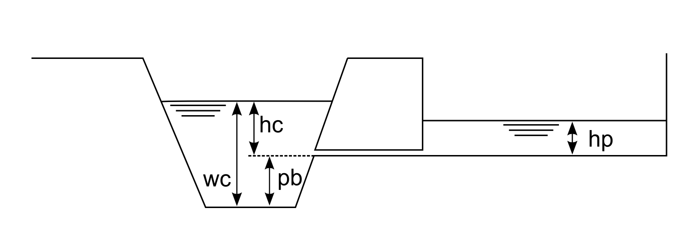
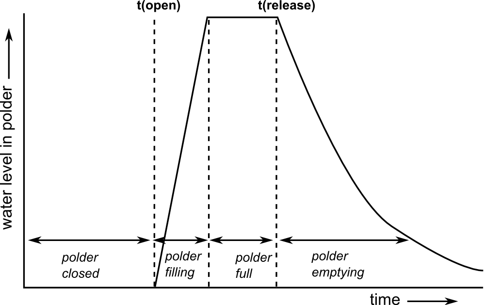
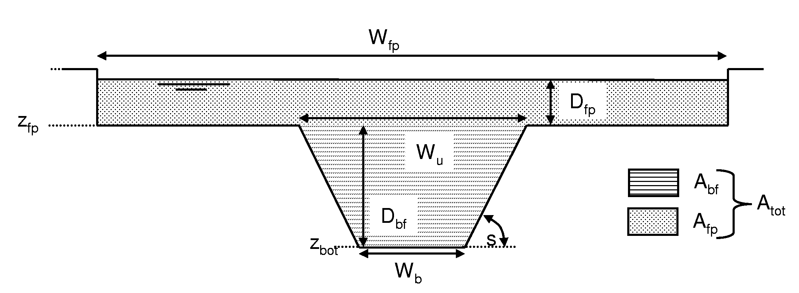

## Incomplete modules

This Annex provides information on code functionalities which were (partially) developed in the past, but are not currently readily available for use.
Development and maintenance of these functionalities has been dismissed. The relevant code is still included in the open source repository, but its use would require updating and/or bug-fixing. The documentation provided in this annex aims to keep track of these functionalities, for possible future use or uptake by external collaborators. Nevertheless, this documentation might be incomplete and affected by imprecisions.

Incomplete modules are: [dynamic wave routing](/4_3_annex_incomplete-modules/index.md#dynamic-wave-routing), [polders](/4_3_annex_incomplete-modules/index.md#polder-option), [variable water fraction](/4_3_annex_incomplete-modules/index.md#variable-water-fraction-option), [reporting of channel water depth values](/4_3_annex_incomplete-modules/index.md#reporting-of-channel-water-depth-values).


### Dynamic wave routing

#### Introduction

A future development of the model can feature the implementation of the dynamic solution of the Saint Venant equations. This page describes one option for such a further development.
> Within the current implementation, the option *dynamicWave* must be switched off.

#### PCRaster solution of the diffusive wave formulation

PCRaster provides a solution of the diffusive wave formulation of the Saint Venant equations which includes the friction force term, the gravity force term and the pressure force term. The equations are solved as an explicit, finite forward difference scheme. 

##### Time step selection

The numerical solution requires a time step that is much smaller (order of magnitude: seconds-minutes) than the typical overall time step used by LISFLOOD (order of magnitude: hours-day). More specifically, during one (sub) time step no water should be allowed to travel more than 1 cell downstream, i.e.:

$$
\Delta '{t_{dyn}} \le \frac{\Delta x}{V + {c_d}}
$$

where 
    <br> $\Delta 't_{dyn}$ is the sub-step for the dynamic wave $[seconds]$, 
    <br> $\Delta x$ is the length of one channel element (pixel) $[m]$, 
    <br> $V$ is the flow velocity $[\frac{m}{s}]$ and 
    <br> $c_d$ is dynamic wave celerity $[\frac{m}{s}]$. 

The dynamic wave celerity can be calculated as (Chow, 1988):

$$
{c_d} = \sqrt {g \cdot y}
$$

where $g$ is the gravitational acceleration $[\frac{m}{s^{2}}]$ and $y$ is the flow depth $[m]$. For a cross-section of a regular geometric shape, $y$ can be calculated from the channel dimensions. When using irregularly shaped cross-section data, $y$ can be approximated by the water level above the channel bed. 

The flow velocity is simply:

$$
V = \frac{Q_{ch}}{A}
$$

where 
    <br> $Q_{ch}$ is the discharge in the channel $[\frac{m^3}{s}]$, and 
    <br> $A$ the cross-sectional area $[m^2]$.

The Courant number, $C_{dyn}$, can now be computed as:

$$
C_{dyn} = \frac{(V + c_d) \cdot \Delta t}{\Delta x}
$$

where $\Delta t$ is the overall model time step $[s]$. 
    
The number of sub-steps of the numerical solution is then given by:

$$
SubSteps = \max \left(1, \; roundup \left(\frac{C_{dyn}}{C_{dyn,crit}} \right) \right)
$$

where $C_{dyn,crit}$ is the critical Courant number. The maximum value of the critical Courant number is 1; in practice, it is safer to use a somewhat smaller value, such as 0.4. 

##### Input data

A number of additional input files are necessary to solve the diffusion wave equations:

1. A boolean map that defines the channel stretches for which this numerical solution has to be used.
2. A cross-section identifier map that links the (diffusion or dynamic wave) channel pixels to the cross-section table (see further down).
3. A channel bottom level map that describes the bottom level of the channel (relative to sea level).
4. A cross-section table that describes the relationship between water height ($H$), channel cross-sectional area ($A$) and wetted perimeter ($P$) for a succession of $H$ levels.

The following table lists all the required inputs:

***Table. Input data required for the the dynamic wave simulation.***  

| Maps              | Default name  | Description                           | Units                            | Remarks |
| ----------------- | ------------- | ------------------------------------- | -------------------------------- | ------- |
| ChannelsDynamic   | chandyn.map   | dynamic wave channels (1,0)           | -                                | boolean |
| ChanCrossSections | chanxsect.map | channel cross section IDs             | -                                | nominal |
| ChanBottomLevel   | chblevel.map  | channel bottom level                  | $m$                              |         |
| **Tables**        |               |                                       |                                  |         |
| TabCrossSections  | chanxsect.txt | cross section parameter table (H,A,P) | H: $m$ <br> A: $m^2$ <br> P: $m$ |         |

##### Layout of the cross-section parameter table

The cross-section parameter table is a text file that contains --for each cross-section ($ID$)-- a sequence of water levels ($H$) with their corresponding cross-sectional area ($A$) and wetted perimeter ($P$). The format of each line is as follows:

> ID H A P

As an example:

```text
+---------------------------------+
| ID H A P                        |
| 167 0 0 0                       |
| 167 1.507 103.044 114.183       |
| 167 3.015 362.28 302.652        |
| 167 4.522 902.288 448.206       |
| 167 6.03 1709.097 600.382       |
| 167 6.217 1821.849 609.433      |
| 167 6.591 2049.726 615.835      |
| 167 6.778 2164.351 618.012      |
| 167 6.965 2279.355 620.14       |
| 167 7.152 2395.037 626.183      |
| 167 7.526 2629.098 631.759      |
| 167 7.713 2746.569 634.07       |
| 167 7.9 2864.589 636.93         |
| 167 307.9 192201.4874 5225.1652 |
+---------------------------------+
```


Note here that the first $H$ level is always 0, for which $A$ and $P$ are, of course, 0 as well. For the last line for each cross-section it is recommended to use some very (i.e. unrealistically) high $H$ level. The reason for doing this is that the dynamic wave routine will crash if during a simulation a water level (or cross-sectional area) is simulated which is beyond the range of the table. This can occur due to a number of reasons (e.g. if the measured cross-section is incomplete, or during calibration of the model). To estimate the corresponding values of $A$ and $P$ one could for example calculate $dA/dH$ and $dP/dH$ over the last two 'real' (i.e. measured) $H$ levels, and extrapolate the results to a very high $H$ level.

The number of $H/A/P$ combinations that are used for each cross section is user-defined. LISFLOOD automatically interpolates in between the table values.

##### Using the numerical solution wave

The `lfuser` element of the settings file has already been edited for the use of the dynamic wave solution. In fact, it contains two parameters that can be set by the user: *CourantDynamicCrit* (which should always be smaller than 1), and a parameter called *DynWaveConstantHeadBoundary*, which defines the boundary condition at the most downstream cell. All remaining dynamic-wave related inputs can be defined in the `lfbinding` element, and do not require any changes from the user (provided that all default names are used, all maps are in the standard "maps" directory and the profile table is in the "tables" directory). In `lfuser` this will look like this:

```xml
	<comment>                                                           
	**************************************************************               
	DYNAMIC WAVE OPTION                                                   
	**************************************************************               
	</comment>                                                          
	<textvar name="CourantDynamicCrit" value="0.5">                 
	<comment>                                                           
	Critical Courant number for dynamic wave                              
	value between 0-1 (smaller values result in greater numerical         
	accuracy,                                                             
	but also increase computational time)                                 
	</comment>                                                          
	</textvar>                                                          
	<textvar name="DynWaveConstantHeadBoundary" value="0">          
	<comment>                                                           
	Constant head [m] at most downstream pixel (relative to altitude    
	at most downstream pixel)                                             
	</comment>                                                          
	</textvar>                                                          
```


### Polder option 

#### Introduction

This page describes the LISFLOOD polder routine, and how it is used. The simulation of polders is *optional*, and it can be activated by adding the following line to the 'lfoptions' element of the [settings file](https://github.com/ec-jrc/lisflood-code/blob/master/src/settingsEUMerged.xml):

```xml
	<setoption name="simulatePolders" choice="1" />
```

The routing was designed to work in channels where routing is modelled using the dynamic wave solution.

#### Polders

Polders are simulated as points in the channel network. The polder routine is adapted from Förster et. al (2004), 
and based on the weir equation of Poleni (Bollrich & Preißler, 1992). 
The flow rates from the channel to the polder area and vice versa are calculated by balancing out the water levels in the channel and in the polder, as shown in the following Figure:


***Figure:*** *Schematic overview of the simulation of polders.* $p_b$ *is the polder bottom level (above the channel bottom);* $w_c$ *is the water level in the channel;* $h_c$ *and* $h_p$ *are the water levels above the polder in- / outflow, respectively*


From the Figure, it is easy to see that there can be three situations:

1.  $h_c > h_p$: water flows out of the channel, into the polder. The flow rate, $q_{c,p}$ [$\frac{m^3}{s}$], is calculated using:

    $q_{c,p}= \mu \cdot c \cdot b \cdot  \sqrt{2g} \cdot h_c^{3/2}$
    $c = \sqrt{1 - [\frac{h_p}{h_c}]^{16}}\end{array}$

    where 
        <br> $b$ is the outflow width $[m]$, 
        <br> $g$ is the acceleration due to gravity ($9.81\ \frac{m}{s^2}$),
        <br> $\mu$ is a weir constant which has a value of 0.49,
        <br> $c$ is the weir factor.


2.  $h_c < h_p$: water flows out of the polder back into the channel. The flow rate, $q_{p,c}$ [$\frac{m^3}{s}$] is now calculated using:

    $q_{p,c} = \mu \cdot c \cdot b\sqrt{2g} \cdot h_p^{3/2}$
    $c = \sqrt {1 - [\frac{h_c}{h_p}]^{16}}\end{array}$
    
3.  $h_c = h_p$: no water flowing into either direction (note here that the minimum value of $h_c$ is zero). In this case both $q_{c,p}$ and  $q_{p,c}$ are zero.


### Regulated and unregulated polders

The above equations are valid for *unregulated* polders. The functioning of *regulated* polders is simulated according to the schematic shown in the following Figure. 



***Figure:*** *Simulation of a regulated polder. Polder is closed (inactive) until user-defined opening time, after which it fills up to its capacity (the flow rate is $q_{c,p}$ and it is computed using the above defined equation). 
Water stays in polder until user-defined release time, after which water is released back to the channel (flow rate is now $q_{p,c}$ and it is computed using the above defined equation).*

Regulated polders are opened at a user-defined time (typically during the rising limb of a flood peak). The polder closes automatically once it is full. Subsequently, the polder is opened again to release the stored water back into the channel, which also occurs at a user-defined time. The opening- and release times for each polder are defined in two lookup tables. In order to simulate the polders in *unregulated* mode these times should both be set to a bogus value of -9999. *Only* if *both* opening- and release time are set to some other value, LISFLOOD will simulate a polder in regulated mode. Since LISFLOOD only supports *one* single regulated open-close-release cycle per simulation, you should use regulated mode *only* for single flood events. For continuous simulations (e.g. long-tem waterbalance runs), it is recommended to use the unregulated mode.


#### Preparation of the input data 

The locations of the polders are defined on a (nominal) map called '*polders.map*'. Any polders that are *not* on a channel pixel are ignored by LISFLOOD, so you may want to check the polder locations before running the model (you can do this by displaying the polder map on top of the channel map). The current implementation of the polder routine may result in numerical instabilities for kinematic wave pixels, so for the moment it is recommended to define polders *only* on channels where the dynamic wave is used. 
The properties of each polder are described using a number of tables. All the required input data are listed below:

**Table:** *Input requirements polder routine.* 

| **Maps**    | **Defaultname**   | **Description** | **Units**   | **Remarks** |
|-------------|-------------|-------------|-------------|-------------|
| PolderSites | polders.map | polder locations     | \-          | nominal     |
| **Tables**  | **Defaultname**   | **Description** | **Units**   | **Remarks** |
| TabPolderArea | poldarea.txt | polder area | $m^2$  |             |
| TabPolderOFWidth | poldofw.txt | polder in- and outflow width  | $m$     |             |
| TabPolderTotalCapacity | poldcap.txt | polder storage capacity     | $m^3$ |             |
| TabPolderBottomLevel | poldblevel.txt | Bottom level of polder, measured from channel bottom level (see also Figure above)     | $m$      |             |
| TabPolderOpeningTime | poldtopen.txt | Time at which polder is opened    | $time step$ |             |
| TabPolderReleaseTime | poldtrelease.txt | Time at which water stored in polder is released again     | $time step$ |             |

Note that the polder opening- and release times are both defined a *time step* numbers (*not* days or hours!!). For *unregulated* polders, set both parameters to a bogus value of -9999, i.e.:


```text
10 -9999
15 -9999
16 -9999 
17 -9999
```


#### Preparation of settings file

All in- and output files need to be defined in the settings file. If you are using a default LISFLOOD settings template, 
all file definitions are already defined in the 'lfbinding' element. 
Just make sure that the map with the polder locations is in the "maps" directory, and all tables in the 'tables" directory. 
If this is the case, you only have to specify the initial reservoir water level in the polders. 
*PolderInitialLevelValue* is defined in the 'lfuser' element of the settings file, and it can be either a map or a value. 
The value of the weir constant *μ* is also defined here, although you should not change its default value. So we add this to the 'lfuser' element (if it is not there already):

```xml
	<group>                                                             
	<comment>                                                           
	**************************************************************               
	POLDER OPTION                                                         
	**************************************************************               
	</comment>                                                          
	<textvar name="mu" value="0.49">                                
	<comment>                                                           		
	Weir constant [-] (Do not change!)                                  
	</comment>                                                          
	</textvar>                                                          
	<textvar name="PolderInitialLevelValue" value="0">              
	<comment>                                                           
	Initial water level in polder [m]                                   
	</comment>                                                          
	</textvar>                                                          
	</group>                                                            
```

To switch on the polder routine, add the following line to the 'lfoptions' element:

```xml
	<setoption name="simulatePolders" choice="1" />
```

Now you are ready to run the model. If you want to compare the model results both with and without the inclusion of polders, you can switch off the simulation of polders either by:

1. Removing the 'simulatePolders' statement from the 'lfoptions element, or
2. changing it into \<setoption name=\"simulatePolders\" choice=\"0\" /\>

Both have exactly the same effect. You don't need to change anything in either 'lfuser' or 'lfbinding'; all file definitions here are simply ignored during the execution of the model.


#### Polder output files

The polder routine produces 2 additional time series and one map (or stack of maps, depending on the value of LISFLOOD variable *ReportSteps*), as listed in the following table:

**Table:** *Output of polder routine.*

| **Maps / Time series** | Default name | Description                                                  | Units           |
| ---------------------- | ------------ | ------------------------------------------------------------ | --------------- |
| PolderLevelState       | hpolxxxx.xxx | water level in polder at last time step                    | $m$             |
| PolderLevelTS          | hPolder.tss  | water level in polder (at polder locations)                  | $m$             |
| PolderFluxTS           | qPolder.tss  | Flux into and out of polder (positive for flow from channel to polder, negative for flow from polder to channel) | $\frac{m^3}{s}$ |

Note that you can use the map with the polder level at the last time step to define the initial conditions of a succeeding simulation, e.g.:

```xml
	<textvar name="PolderInitialLevelValue" value="/mycatchment/hpol0000.730">
```


#### Limitations

This module was concieved for areas where **dynamic wave routing** is used. For channels where the kinematic wave is used, the routine will not work and may lead to numerical instabilities or even model crashes. 


### Variable water fraction option


#### Introduction

This option allows to specify the seasonal variation of water fraction.
The option can be activated adding the following line to the `lfoption` element in the LISFLOOD settings file:

```xml 
<setoption choice="1" name="varfractionwater"/>
```

#### Description of the variable water fraction option

If the variable water fraction option is activated, the water fraction varies seasonally.
In order to maintain the sum of land fraction constant (at 1), the fractions other than water need to be recalculated at each step to account for the extra amount of water.

In addition to defining the water fraction $F_{water}$, the variable water fraction requires the user to define a maximum fraction of water per pixel $f_{water,max}$ and a time-variable factor representing the relative positioning of the monthly value of water fraction between the two extremes $\delta f_{water,i}$ (with $i = 1,2,\ldots 12$).
Given these inputs, the differentail water fraction is determined by linear interpolation:

$$
\Delta f_{water,i} = \delta f_{water,i} \cdot \left ( f_{water,max} - f_{water} \right )
$$

$\Delta f_{water,i}$ represents the additional amount of water at month $i$ compared to the baseline in $f_{water}$ and it is the amount that needs to be removed from the other fractions in order to maintain the sum equal to 1.
This is done iteratively removing fractions in order (first $f_{other}$, then $f_{forest}$, $f_{irrig}$ and $f_{runoff}$)  until they reach $0$ or until $\Delta f_{water,i}$ runs out:
<br>$f_{other,i}=\max(f_{other} - \Delta f_{water,i}),0)$ and $e_{other,i}= \max(\Delta f_{water,i} - f_{other},0)$
<br>$f_{forest,i}=\max(f_{forest} - e_{other,i},0)$ and $e_{forest,i}=\max(e_{other,i} - f_{forest},0)$
<br>$f_{irrig,i}= \max(f_{irrig} - e_{forest,i},0)$ and $e_{irrig,i}= \max(e_{forest,i} - f_{irrig,0})$
<br>$f_{runoff,i}= \max(f_{runoff} - e_{irrig,i},0)$

Where, for each land type $k$:
   <br> $f_{k,i}$ is the fraction of land type $k$ at for month $i$;
   <br> $e_{k,i}$ is the remainder of $\Delta f_{water,i}$ still to be distributed after $f_{k,i}$ has been calculated.

#### Preparation of input data

In order to use the transient land use change option, the following maps and map stacks need to be provided:

***Table:***  *Input requirements for variable water fraction option.*                                                                              

| **Maps**        | **Default name**  | **Description**                                   | **Units** | **Remarks**                                                   |
| ----------------| ----------------- | ------------------------------------------------- | --------- | ------------------------------------------------------------- |
| WaterFraction   | fracwater         | Map of water fraction in a pixel                  | -         | Already required, regardless of variable water fraction option|
| FracMaxWater    | fracmaxwater      | Map of maximum water fraction in a pixel          | -         |                                                               |
| WFractionMaps   | varW              | Map stack of seasonal variation of water fraction | -         | 12 maps, one per month.                                       |

> **_NOTE:_** The values in _WFractionMaps_ are in the range [0,1] and represent the relative monthly value of water fraction between the two extremes determined by the maps _WaterFraction_ and _FracMaxWater_. 
> * A _WFractionMaps_ value of 0 implies that, for that month, the water fraction is equal to the map _WaterFraction_.
> * A _WFractionMaps_ value of 1 implies that it is equal to _FracMaxWater_. 
> * Values in between are linearly interpolated.

#### Preparation of settings file

All input files need to be defined in the settings file.
If you are using a default LISFLOOD settings template, all file definitions are already defined in the `lfbinding` element. Just make sure that the maps are in the directory indicated by *PathMaps*.

```xml
<textvar name="WaterFraction" value="$(PathMaps)/fracwater">
    <comment>
    $(PathMapsLanduse)/fracwater.map
    Water fraction of a pixel (0-1)
    </comment>
</textvar>

<textvar name="FracMaxWater" value="$(PathMaps)/fracmaxwater">
    <comment>
    Fraction of maximum extend of water (0-1)
    </comment>
</textvar>

<textvar name="WFractionMaps" value="$(PathMaps)/varW">
    <comment>
    Map stack of seasonal variation of water fraction (0-1)
    </comment>
</textvar>
```

#### Functionality currently maintained

Users interested in the modelling of seasonal variation of water fraction might consider the **Transient land use change option**.


### Reporting of channel water depth values

#### Introduction

Within LISFLOOD it is possible to simulate and report water level values from the channel bottom (water depth). This is achieved by switching on a dedicated module called "simulateWaterLevels". 

> **_NOTE:_**The use of *level* is not fully correct, and it should be replaced by *depth* in improved versions of the module (important note: *waterdepth* output name is already used to indicate the water depth of the surface runoff or overalnd flow, as explained in [this section](https://ec-jrc.github.io/lisflood-code/4_annex_output-files/) of the LISFLOOD User Guide).

The module "simulateWaterLevels" is *optional*, and it can be activated by adding the following line to the 'lfoptions' element:

```xml
	<setoption name="simulateWaterLevels" choice="1" />
```
Using this option does *not* influence flow routing results, and it is only a reporting option.
Water level values from the channel bottom (water depth values) are calculated *only* for river channel pixels where flow routing is computed *using the [kinematic wave](/3_05_optLISFLOOD_kinematic-wave) solution*. Computed water level values from the channel bottom can include both the main channel and (where needed) the second line of routing (Split Routing option).

**Limitation 1** : In the current implementation, water level values from the channel bottom (water depth values) are not reported for pixels where routing is computed using the [diffusive wave routing](/3_14_optLISFLOOD_diffusive-wave). 

**Limitation 2** : In the current implementation, specif gemetrical and flow conditions can return non-physical results in some pixels, even when using the kinematic wave routing. The cause of these non-physical results must be further investigated.

**Limitation 3** : The computation of water level values from the channel bottom (water depth values) requires information about river geometry (bathymetry). **Inaccuracies in the representation of channel geometry will directly affect the computation of water level**. As detailed in the chapter [Channel geomtery](/4_Static-Maps_channel-geometry/index.md) of the [user guide](https://ec-jrc.github.io/lisflood-code/), OS LISFLOOD assumes a trapezoidal cross section (image below), with geometrical parameters (e.g. bottom width, banckfull depth) computed using approximated equations or continenatl to global datasets. These approximations must be taken into account when using the results of the module described in this page.

#### Calculation of water level values from the channel bottom

When using the kinematic solution of the Saint Venant Equations, only approximate water levels can be estimated from the cross-sectional (wetted) channel area, $A_{ch}$ for each time step. Since the channel cross-section is described as a trapezoid, water levels follow directly from $A_{ch}$ , channel bottom width, side slope and bankfull level. If $A_{ch}$ exceeds the bankfull cross-sectional area ($A_{bf}$), the surplus is distributed evenly over the (rectangular) floodplain, and the depth of water on the floodplain is added to the (bankfull) channel depth. The Figure below further illustrates the cross-section geometry. All water levels are relative to channel bottom level ($z_{bot}$ in the Figure).


***Figure:*** *Geometry of channel cross-section in kinematic wave routing. With* $W_b$: *channel bottom width;* $W_u$: *channel upper width;* $z_{bot}$: *channel bottom level;* $z_{fp}$: *floodplain bottom level;* $s$: *channel side slope;* $W_{fp}$: *floodplain width;* $A_{bf}$: *channel cross-sectional area at bankfull;* $A_{fp}$: *floodplain cross-sectional area;* $D_{bf}$: *bankfull channel depth,* $D_{fp}$: *depth of water in the floodplain.*

In order to calculate water levels, LISFLOOD needs a map with the width of the floodplain in \[m\], which is defined by 'lfbinding' variable *FloodPlainWidth* (the default name of this map is *chanfpln.map*).

#### Reporting of water levels

Water levels can be reported as time series (at the gauge locations that are also used for reporting discharge), or as maps.

To generate a time series, add the following line to the 'lfoptions' element of your settings file:

```xml
	<setoption name="repWaterLevelTs" choice="1" />
```
The reporting options should be used *in addition* to the 'simulateWaterLevels' option. If you do not include the 'simulateWaterLevels' option, there will be nothing to report and LISFLOOD will exit with an error message.

For maps, the following line **and** a correction in the source code (global_modules/default_options.py) are **both** needed:

```xml
	<setoption name="repWaterLevelMaps" choice="1" />
```


#### Preparation of settings file

The naming of the reported water level time series and maps is defined in the settings file. If you are using a default LISFLOOD settings template, all file definitions are already defined in the 'lfbinding' element.

Time series:

```xml
	<textvar name="WaterLevelTS" value="$(PathOut)/waterLevel.tss"> 
	<comment>                                                            
	Reported water level [m]                                             
	</comment>                                                           
	</textvar>                                                           
```

Map stack (requiring a correction in the source code: global_modules/default_options.py):

```xml
	<textvar name="WaterLevelMaps" value="$(PathOut)/wl"> 
	<comment>                                                  
	Reported water level [m]                                   
	</comment>                                                 
	</textvar>                                                 
```


[🔝](#top)


